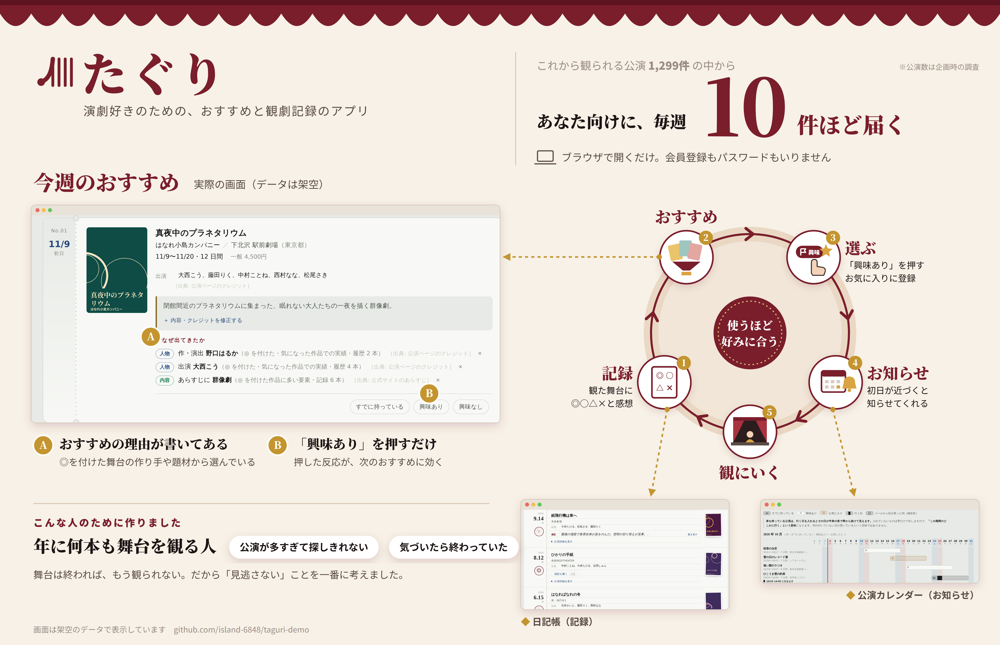

# たぐり：演劇のおすすめと観劇記録のアプリ

<p align="center"></p>

観た演劇の記録と評価をもとに、次に観たい公演を毎週届けるWebアプリです。個人開発です。

**デモ**: https://island-6848.github.io/taguri-demo/
（画面はGitHub Pages配信、推薦計算・データはRender上のAPI（`tools/taguri/serve_cloud.py`）が持つ。
無料枠のため、しばらくアクセスがないと初回の読み込みに10〜20秒ほどかかることがあります）

**プレゼン資料**: https://island-6848.github.io/taguri-demo/docs/000003-final-presentation-taguri.html

## たぐりでできること

観たかった舞台が、気づいたら終わっていた。たぐりは、そんな見逃しを減らすための演劇アプリです。これから観られる公演の中から、あなたに合いそうな舞台を毎週届けます。

使い方は3つの動きだけです。

1. **おすすめを開く。** 公演ごとに「なぜおすすめなのか」の理由が書いてあります。
2. **「興味あり」を押す。** 押した公演は一覧と公演カレンダーに並び、いつまで観られるかが分かります。
3. **観たら◎○△×と感想を残す。** 記録は日記帳にたまり、次のおすすめがあなたの好みに近づきます。

初めての方は、デモ画面の右下にある「使い方」から、実際の画面で試せる操作ツアーと、約70秒の説明動画を開けます（動画は[`web/assets/taguri-howto.mp4`](web/assets/taguri-howto.mp4)）。

## 安心して使える理由

- **登録もパスワードもいりません。** 初回に発行される復旧コード（128bit）とセッションCookieで利用者を見分けるので、メールアドレスもパスワードも預かりません。実装は`tools/taguri/auth.py`にあります。
- **おすすめの理由が見えます。** 順位づけにLLMは使わず、記録から数えた統計で決めています。そのため、理由を毎回示せます。LLM（Gemini API）を使うのは、あらすじから要素を取り出す作業だけです。根拠と実測は`docs/000007-taguri-design.md`にあります。
- **外部への送信を絞っています。** 画面から外部サイトを直接呼ぶことはなく、公演情報の取得は専用のバッチ処理だけが、1リクエスト/秒を守って行います。詳細は`docs/000007-taguri-security-rules.md`にあります。
- **Pythonの標準ライブラリだけで動きます。** pipで追加のインストールをしなくても、環境が変わって動かなくなることがありません（`urllib`・`sqlite3`・`http.server`で完結）。

## 技術構成

- Python標準ライブラリのみ（Webフレームワーク不使用、`http.server`を直接使用）
- SQLite（永続化）
- Gemini API（あらすじ・要素抽出のみ、順位づけには使わない）
- 公演情報の取得元: CoRich・ステイジーズカレンダー

### 公開デモの構成（GitHub Pages + Render）

画面（`web/`、静的ファイルのみ）はGitHub Pagesから配信し、推薦計算・DB書き込みは
今までどおりRender上のAPI（`tools/taguri/serve_cloud.py`）が担う。`web/`のJSが
CORS越しにRenderのJSON API（`/api/screen/*`・`/api/react`等）を叩き、返ってきた
HTML断片を画面に差し込む形にした。GitHub Pagesは静的配信専用でサーバサイド
コードを実行できないため、DB書き込みを伴う本体はRenderに残している。
ローカル・EC2向けの`run.py`経路（`127.0.0.1`固定・起動ごとトークン認証）は
この移行の影響を受けず、今までどおり動く。

## ドキュメント

設計判断とその理由を記録したドキュメントを同梱しています。

- [`docs/000007-taguri-design.md`](docs/000007-taguri-design.md) ── 全体設計
- [`docs/000007-taguri-security-rules.md`](docs/000007-taguri-security-rules.md) ── セキュリティ規約
- [`docs/000007-taguri-terms-of-use.md`](docs/000007-taguri-terms-of-use.md) ── 利用規約
- [`docs/000003-final-presentation-taguri.html`](https://island-6848.github.io/taguri-demo/docs/000003-final-presentation-taguri.html) ── プレゼン資料（ブラウザで表示。[ソース](docs/000003-final-presentation-taguri.html)）

## ローカルで動かす

```bash
python3 tools/taguri/run.py --no-open   # 動作確認用（画面は開かない）
```

## 補足

このリポジトリは公開用に、実データ・検証記録を除いたコードとドキュメントのみで構成しています。デモ用の体験データ（`data/review/`）は架空の評価・お気に入りを含みますが、公演情報自体は実在するものです。


